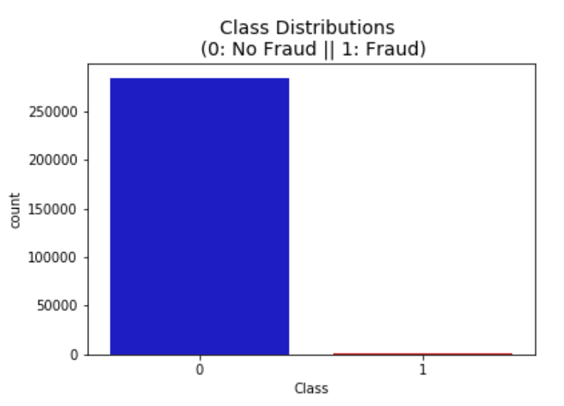
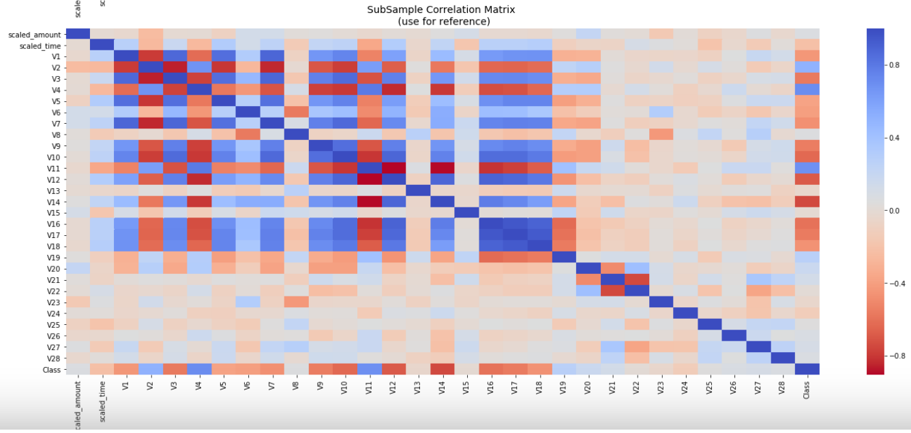
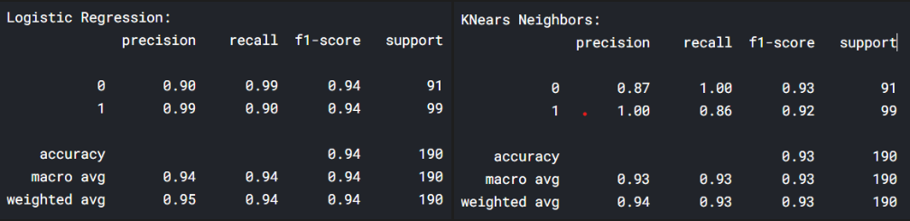
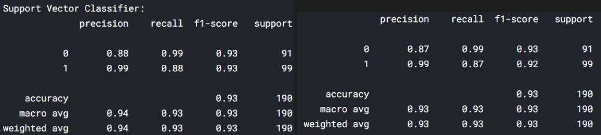
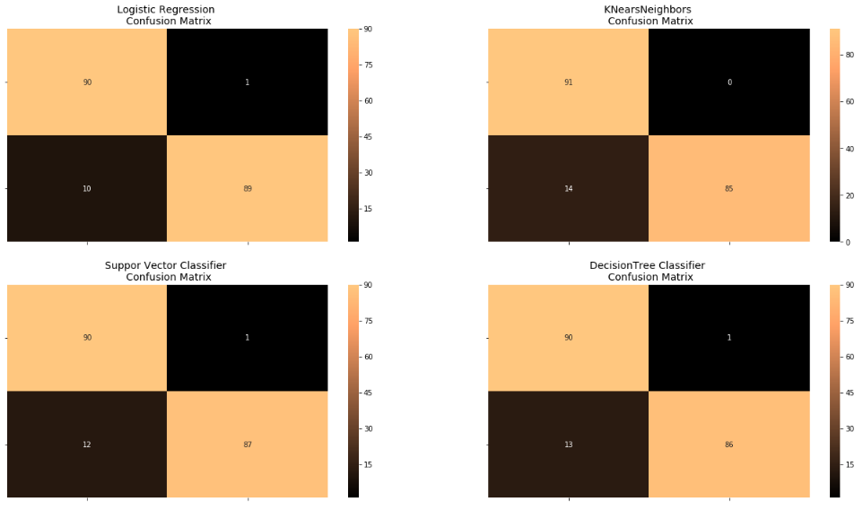
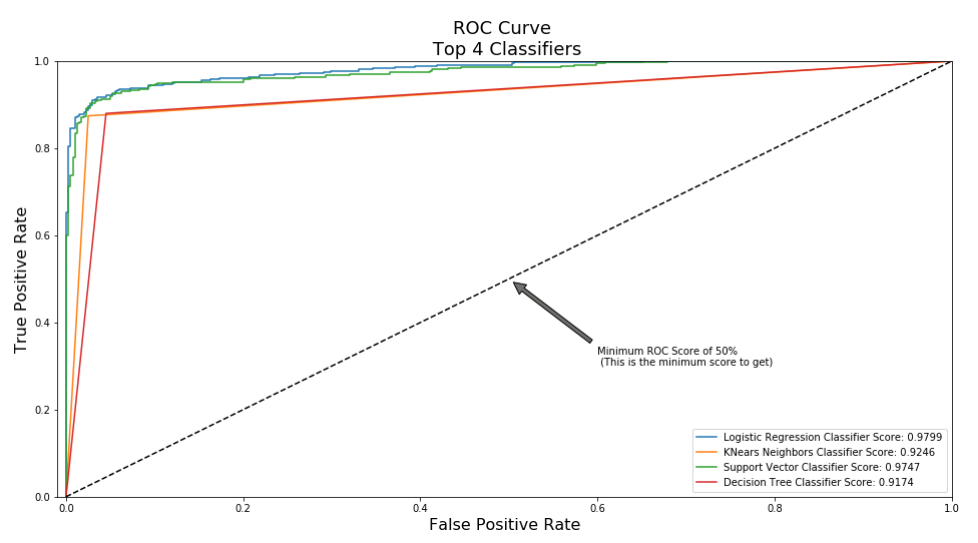
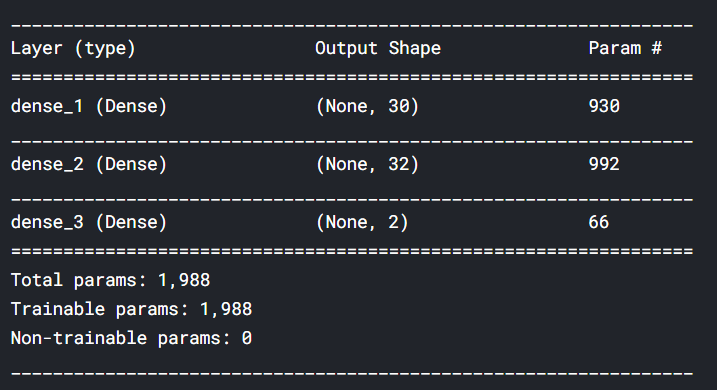
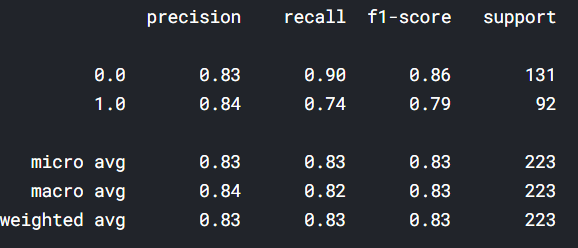

# **Bank fraud detection**
 

## **I. Definition**
****
> (from wiki): is the use of potentially illegal means to obtain money, assets, or other property owned or held by a financial institution, or to obtain money from depositors by fraudulently posing as a bank or other financial institution.

Type of bank fraud:

1. Accounting fraud
2. Demand draft fraud
3. __Remotely created check fraud__
4. Uninsured deposits
5. __Bill discounting fraud__
6. __Duplication or skimming of card information__
7. Cheque kiting
8. Forged or fraudulent documents
9. Forgery and altered cheques
10. __Fraudulent loan applications__
11. __Fraudulent loans__
12. Empty ATM envelope deposits
13. The fictitious 'bank inspector'
14. __Identity theft or Impersonation__
15. __Money laundering__
16. __Payment card fraud__
    1.  Application fraud
    2.  Account takeover
    3.  Fake or counterfeit cards
17. Phishing or Internet fraud
    1.  Site cloning
    2.  False merchant sites
    3.  Credit card generators
18. __Rogue traders__
19. Stolen checks
21. __Wire transfer fraud__

- Existing application: freedzai, datavisor, teradata
   
****

## **II. Data**
****
### In public: 
- the most feature (characteristic,  column) of data is transformed because of primary information. So we don't know original feature of data, correlation of field in data.
- Imbalanced datasets: all of cases, number of data with fraud label is very smaller than with non-fraud (normal transaction).Example in [this dataset](https://www.kaggle.com/mlg-ulb/creditcardfraud), Most of the transactions were Non-Fraud (99.83%) of the time, while Fraud transactions occurs (0.17%) of the time in the data.
> + use precision, recall, f1-score metrics to evaluate model (normal accuracy is not completely correct)
> + Downsample majority class
  
   
****

## **III. Methods**
****

Example in [kaggle](https://www.kaggle.com/mlg-ulb/creditcardfraud)
> **metadata**:
- 284807 transcations: 284315 Non-Frauds (normal transaction)(99.828%) and 492 Frauds (0.172%)
- 30 fields in which 28 fields are transformed from original features by PCA. Only 2 original fields are "Time" (seconds elapsed between each transaction and the first transaction) and "amount" (transaction amount)

visualize class distributions of data

 

correlation matrix of subsample data

> 
> **method**
- Machine learning algorithm

Logistic Regression (left) and K Nearest Neighbors (right)

  

Sunport Vector Classifier (left) and Decision Tree Classifier (right)

  

 Models comparison with confusion matrix

  

   

- Deep learning use SMOTE
  
Neurol Network architecturte

Loss: Sparse categorical crossentropy.

Optimizer: adam

metrics: accuracy

epochs: 20

 evaluate Neurol Network model

   
****

